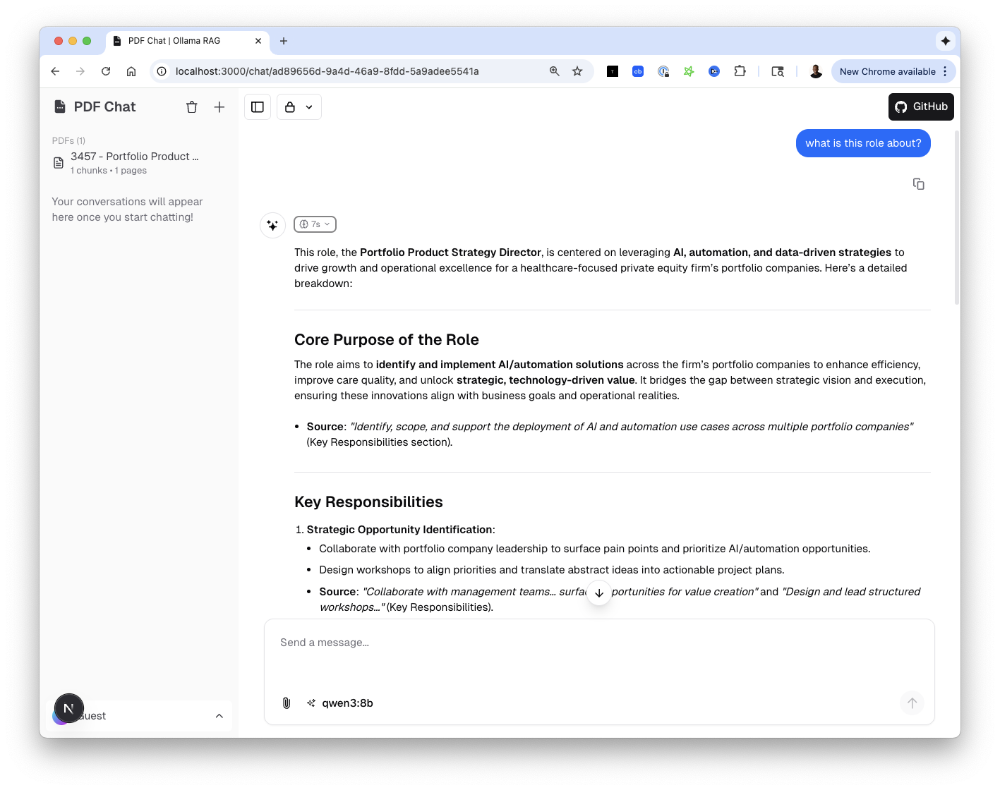
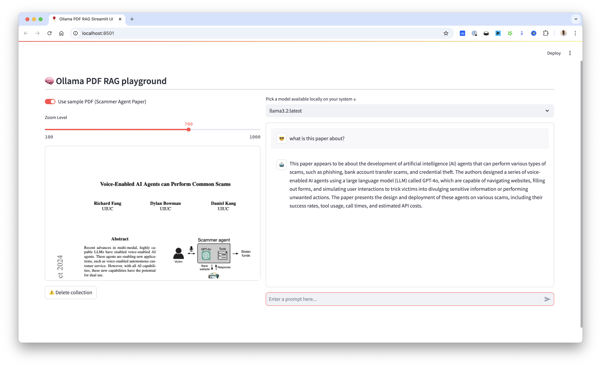

# chat-with-pdf

A powerful local RAG (Retrieval Augmented Generation) application that lets you chat with your PDF documents using Ollama and LangChain. This project includes multiple interfaces: a modern Next.js web app, a Streamlit interface, and Jupyter notebooks for experimentation.

[](https://github.com/tonykipkemboi/ollama_pdf_rag/actions/workflows/tests.yml)

## ✨ Features

- 🔒 **100% Local** - All processing happens on your machine, no data leaves
- 📄 **Multi-PDF Support** - Upload and query across multiple documents
- 🧠 **Multi-Query RAG** - Intelligent retrieval with source citations
- 🎯 **Advanced RAG** - LangChain-powered pipeline with ChromaDB
- 🖥️ **Two Modern UIs** - Next.js (primary) and Streamlit interfaces
- 🔌 **REST API** - FastAPI backend for programmatic access
- 📓 **Jupyter Notebooks** - For experimentation and learning

## 🖼️ Screenshots

### Next.js Interface (Recommended)

*Modern chat interface with PDF management, source citations, and reasoning steps*

### Streamlit Interface

*Classic Streamlit interface with PDF viewer and chat functionality*

## 📺 Video Tutorial
<a href="https://youtu.be/ztBJqzBU5kc">
  
</a>

## 🏗️ Project Structure
```
ollama_pdf_rag/
├── src/
│   ├── api/                  # FastAPI REST API
│   │   ├── routers/          # API endpoints
│   │   ├── services/         # Business logic
│   │   └── main.py           # API entry point
│   ├── app/                  # Streamlit application
│   │   ├── components/       # UI components
│   │   └── main.py           # Streamlit entry point
│   └── core/                 # Core RAG functionality
│       ├── document.py       # PDF processing
│       ├── embeddings.py     # Vector embeddings
│       ├── llm.py            # LLM configuration
│       └── rag.py            # RAG pipeline
├── web-ui/                   # Next.js frontend
│   ├── app/                  # Next.js app router
│   ├── components/           # React components
│   └── lib/                  # Utilities & AI integration
├── data/
│   ├── pdfs/                 # PDF storage
│   └── vectors/              # ChromaDB storage
├── notebooks/                # Jupyter notebooks
├── tests/                    # Unit tests
├── docs/                     # Documentation
├── run.py                    # Streamlit runner
├── run_api.py                # FastAPI runner
└── start_all.sh              # Start all services
```

## 🚀 Getting Started

### Prerequisites

1. **Install Ollama**
   - Visit [Ollama's website](https://ollama.ai) to download and install
   - Pull required models:
     ```bash
     ollama pull llama3.2  # or your preferred chat model
     ollama pull nomic-embed-text  # for embeddings
     ```

2. **Clone Repository**
   ```bash
   git clone https://github.com/tonykipkemboi/ollama_pdf_rag.git
   cd ollama_pdf_rag
   ```

3. **Set Up Python Environment**
   ```bash
   python -m venv venv
   source venv/bin/activate  # On Windows: .\venv\Scripts\activate
   pip install -r requirements.txt
   ```

4. **Set Up Next.js Frontend** (for the modern UI)
   ```bash
   cd web-ui
   pnpm install
   pnpm db:migrate
   cd ..
   ```

### 🎮 Running the Application

#### Option 1: Next.js + FastAPI (Recommended)

Start both services:

```bash
# Terminal 1: Start the FastAPI backend
python run_api.py
# Runs on http://localhost:8001

# Terminal 2: Start the Next.js frontend
cd web-ui && pnpm dev
# Runs on http://localhost:3000
```

Or use the convenience script:
```bash
./start_all.sh
```

**Service URLs:**
| Service | URL | Description |
|---------|-----|-------------|
| Next.js Frontend | http://localhost:3000 | Modern chat interface |
| FastAPI Backend | http://localhost:8001 | REST API |
| API Documentation | http://localhost:8001/docs | Swagger UI |

#### Option 2: Streamlit Interface

```bash
python run.py
# Runs on http://localhost:8501
```

#### Option 3: Jupyter Notebook

```bash
jupyter notebook
```
Open `notebooks/experiments/updated_rag_notebook.ipynb` to experiment with the code.

## 💡 Usage

### Next.js Interface
1. **Upload PDFs** - Click the 📎 button or drag & drop files
2. **View PDFs** - Uploaded PDFs appear in the sidebar with chunk counts
3. **Select Model** - Choose from your locally available Ollama models
4. **Ask Questions** - Type your question and get answers with source citations
5. **View Reasoning** - See the AI's thinking process and retrieved chunks

### Streamlit Interface
1. **Upload PDF** - Use the file uploader or toggle "Use sample PDF"
2. **Select Model** - Choose from available Ollama models
3. **Ask Questions** - Chat with your PDF through the interface
4. **Adjust Display** - Use the zoom slider for PDF visibility
5. **Clean Up** - Delete collections when switching documents

## 🔌 API Reference

The FastAPI backend provides these endpoints:

| Method | Endpoint | Description |
|--------|----------|-------------|
| `POST` | `/api/v1/pdfs/upload` | Upload and process a PDF |
| `GET` | `/api/v1/pdfs` | List all uploaded PDFs |
| `DELETE` | `/api/v1/pdfs/{pdf_id}` | Delete a PDF |
| `POST` | `/api/v1/query` | Query PDFs with RAG |
| `GET` | `/api/v1/models` | List available Ollama models |
| `GET` | `/api/v1/health` | Health check |

See full documentation at http://localhost:8001/docs when running.

## 🧪 Testing

```bash
# Run all tests
python -m pytest tests/ -v

# Run with coverage
python -m pytest tests/ --cov=src
```

### Pre-commit Hooks
```bash
pip install pre-commit
pre-commit install
```

## ⚠️ Troubleshooting

- **Ollama not responding**: Ensure Ollama is running (`ollama serve`)
- **Model not found**: Pull models with `ollama pull <model-name>`
- **No chunks retrieved**: Re-upload PDFs to rebuild the vector database
- **Port conflicts**: Check if ports 3000, 8001, or 8501 are in use

### Common Errors

#### ONNX DLL Error (Windows)
```
DLL load failed while importing onnx_copy2py_export
```
Install [Microsoft Visual C++ Redistributable](https://learn.microsoft.com/en-us/cpp/windows/latest-supported-vc-redist) and restart.

#### CPU-Only Systems
Reduce chunk size if experiencing memory issues:
- Modify `chunk_size` to 500-1000 in `src/core/document.py`


---

Built with ❤️ by [doniruswer-lgtm](https://github.com/doniruswer-lgtm)
